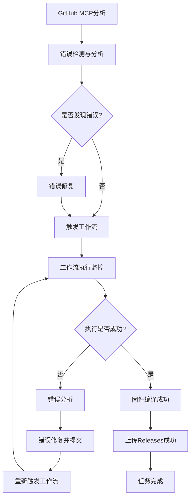

# GitHub MCP构建修复与部署任务设计文档

> **任务目标**: 通过GitHub MCP分析和修复onecloud-openwrt-trubo项目的编译固件工作流报错问题，确保固件成功编译并上传到Releases

## 1.1 项目背景

onecloud-openwrt-trubo项目是一个为迅雷玩客云（OneCloud）设备定制的纯净版OpenWrt固件项目。该项目基于官方OpenWrt源码构建，移除了所有第三方插件和不必要的组件，只保留核心路由功能和必要的管理工具。

### 1.2 项目目标
- 提供稳定、纯净的OpenWrt固件
- 简化玩客云设备的固件烧录和使用流程
- 集成常用插件和工具
- 支持线刷和卡刷两种固件格式

## 1.3 核心问题

当前项目在GitHub Actions中的编译固件工作流存在报错问题，导致固件无法成功编译并上传到Releases。需要通过GitHub MCP分析错误原因，进行修复，并确保整个构建流程能够顺利完成。

## 1. 概述

本设计文档旨在分析和修复onecloud-openwrt-trubo项目在GitHub Actions中编译固件工作流的报错问题，并确保固件成功编译并上传到Releases。该任务将通过GitHub MCP调用分析工作流错误，进行修复，并主动触发build-openwrt工作流进行固件编译，全程监控编译过程，遇到错误及时修复并重新触发工作流，直至固件编译成功并上传Releases。

## 2. 系统架构

### 2.1 技术栈
- **CI/CD平台**: GitHub Actions
- **版本控制**: Git
- **构建系统**: OpenWrt构建系统
- **脚本语言**: Shell脚本
- **监控工具**: GitHub MCP
- **部署目标**: GitHub Releases

### 2.2 目标平台
- **设备**: 迅雷玩客云（OneCloud）
- **架构**: Amlogic S805 (ARM Cortex-A5)
- **内核**: Linux 6.6
- **文件系统**: EXT4

### 2.3 固件特性
- 基于OpenWrt官方最新源码
- 使用Nginx替代uhttpd作为Web服务器
- 采用Argon主题作为默认UI
- 保留核心路由功能（NAT、防火墙、DHCP）
- 包含LuCI Web管理界面
- CPU频率管理（玩客云专用）
- Docker容器支持
- SSH远程管理
- 基础网络工具（curl, wget, htop）



## 3. 核心组件分析

### 3.1 项目结构详情
```
onecloud-openwrt-trubo/
├── .github/workflows/
│   ├── build-openwrt.yml      # 主构建工作流
│   ├── cleanup.yml            # 清理工作流
│   └── update-checker.yml     # 更新检查工作流
├── configs/
│   ├── onecloud.config        # 玩客云设备配置
│   └── feeds.conf.default     # Feed源配置
├── scripts/
│   ├── customize-feeds.sh     # Feed定制脚本
│   ├── customize-firmware.sh  # 固件定制脚本
│   ├── generate-images.sh     # 镜像生成脚本
│   └── setup-environment.sh   # 环境准备脚本
├── files/
│   └── etc/
│       ├── config/            # 系统配置文件
│       └── rc.local           # 启动脚本
├── tools/
│   ├── AmlImg                 # Amlogic镜像工具
│   └── uboot.img              # U-Boot镜像
├── dependencies.txt           # 构建依赖列表
└── README.md                 # 项目说明
```


## 4. 常见错误分析与修复策略

### 4.1 环境初始化错误
**问题**: 环境依赖安装失败或网络连接问题
**表现**: 
- `setup-environment.sh`脚本执行失败
- 依赖包安装超时或失败
- 网络连接不稳定导致下载失败

**修复策略**:
- 增强网络连接检查机制
- 增加依赖安装重试机制（最多3次重试）
- 添加更详细的错误日志输出
- 优化apt源配置以提高下载速度

### 4.2 Feeds源配置错误
**问题**: 第三方源导致的冲突或不兼容
**表现**:
- `feeds update`命令执行失败
- 包依赖冲突
- 某些包无法找到或下载

**修复策略**:
- 确保只使用官方源和允许的Argon主题源
- 清理不必要的第三方源配置
- 验证feeds.conf.default文件格式正确性

### 4.3 固件配置错误
**问题**: 配置文件不正确或缺失
**表现**:
- `.config`文件配置错误
- 关键组件未启用
- 配置项之间存在冲突

**修复策略**:
- 验证`onecloud.config`文件完整性
- 确保关键配置项正确设置
- 添加配置验证脚本

### 4.4 编译过程错误
**问题**: 编译失败或资源不足
**表现**:
- 多线程编译失败
- 磁盘空间不足
- 内存不足导致编译中断

**修复策略**:
- 增加磁盘空间检查（至少10GB可用空间）
- 实现多线程编译失败后的单线程重试机制
- 添加详细的编译日志输出
- 优化资源使用策略

### 4.5 镜像生成错误
**问题**: 镜像生成脚本执行失败
**表现**:
- `generate-images.sh`脚本执行错误
- loop设备设置失败
- 文件系统操作失败

**修复策略**:
- 增强错误处理和资源清理机制
- 添加更详细的调试信息
- 优化loop设备设置和清理流程

### 4.6 Release发布错误
**问题**: GitHub Token权限不足或文件路径错误
**表现**:
- Release发布失败
- 文件上传失败
- Tag创建失败

**修复策略**:
- 验证GitHub Token权限是否足够
- 确保文件路径正确且文件存在
- 添加发布过程的详细日志


## 5. 任务执行流程

### 5.1 初始化阶段
1. 通过GitHub MCP连接到onecloud-openwrt-trubo仓库
2. 获取最新的仓库状态和工作流配置
3. 分析当前工作流配置中的潜在问题
4. 验证GitHub Token权限是否足够

### 5.2 错误检测与修复阶段
1. 检查工作流配置文件(build-openwrt.yml)
2. 验证脚本文件的正确性和权限
3. 检查配置文件完整性
4. 验证依赖文件是否存在
5. 修复发现的问题并提交到仓库

### 5.3 工作流触发与监控阶段
1. 手动触发build-openwrt工作流
2. 实时监控工作流执行状态
3. 收集执行日志和错误信息
4. 检查资源使用情况（磁盘、内存等）

### 5.4 错误处理与重试阶段
1. 分析工作流失败原因
2. 应用针对性修复措施
3. 提交修复并重新触发工作流
4. 重复此过程直至成功

### 5.5 成果验证阶段
1. 验证固件是否成功编译
2. 确认固件文件已上传到Releases
3. 验证发布的Release标签和说明正确
4. 检查固件文件完整性

## 6. 监控与日志策略

### 6.1 实时监控
- 监控GitHub Actions工作流状态（运行中、成功、失败）
- 跟踪编译进度和资源使用情况（CPU、内存、磁盘）
- 捕获错误日志和调试信息
- 监控网络连接状态

### 6.2 日志收集
- 收集环境初始化日志（setup-environment.sh执行日志）
- 收集编译过程日志（make命令输出）
- 收集镜像生成日志（generate-images.sh执行日志）
- 收集Release发布日志（action-gh-release执行日志）
- 收集系统资源使用日志

### 6.3 错误报告
- 生成详细的错误分析报告
- 提供修复建议和解决方案
- 记录修复过程和结果
- 生成执行摘要报告


## 7. 安全与权限管理

### 7.1 GitHub Token权限
- 确保Token具有足够的权限来触发工作流和发布Release
  - `repo`权限：访问私有仓库
  - `workflow`权限：触发工作流
  - `public_repo`权限：访问公共仓库
- 遵循最小权限原则
- 定期轮换Token

### 7.2 代码提交安全
- 验证所有代码更改
- 确保不会引入安全漏洞
- 遵循项目的代码规范
- 使用签名提交保护代码完整性

### 7.3 敏感信息保护
- 不在代码中硬编码敏感信息
- 使用GitHub Secrets存储敏感数据
- 确保日志中不泄露敏感信息


- 验证脚本间依赖关系

### 8.3 配置文件验证
- 验证配置文件格式正确
- 检查关键配置项
- 确保配置符合项目要求
- 验证feeds源配置纯净性

### 8.4 构建结果验证
- 验证生成的固件文件完整性
- 检查固件文件格式正确性
- 验证Release发布内容
- 确认校验和文件生成正确

### 8.1 工作流配置测试
- 验证YAML语法正确性
- 检查环境变量配置
- 测试触发条件

### 8.2 脚本功能测试
- 验证所有shell脚本可执行
- 检查脚本逻辑正确性
- 测试错误处理机制

### 8.3 配置文件验证
- 验证配置文件格式正确
- 检查关键配置项
- 确保配置符合项目要求

## 9. 部署与执行

### 9.1 部署前置条件
- 配置GitHub Personal Access Token并设置适当权限
- 确保有足够的仓库权限（至少Maintainer角色）
- 验证MCP服务器连接正常
- 确保网络连接稳定
- 检查GitHub Actions配额

### 9.2 执行步骤
1. 连接到GitHub仓库（onecloud-openwrt-trubo）
2. 分析当前工作流状态和历史执行记录
3. 检测并修复错误
4. 验证修复后的配置
5. 触发工作流执行
6. 监控执行过程
7. 处理执行中的错误
8. 验证最终结果
9. 生成执行报告

### 9.3 执行监控要点
- 实时检查工作流状态
- 监控资源使用情况
- 收集关键执行日志
- 及时发现并处理错误
- 确保执行过程不中断

### 9.1 部署前置条件
- 配置GitHub Personal Access Token并设置适当权限
- 确保有足够的仓库权限（至少Maintainer角色）
- 验证MCP服务器连接正常
- 确保网络连接稳定
- 检查GitHub Actions配额

### 9.2 执行步骤
1. 连接到GitHub仓库（onecloud-openwrt-trubo）
2. 分析当前工作流状态和历史执行记录
3. 检测并修复错误
4. 验证修复后的配置
5. 触发工作流执行
6. 监控执行过程
7. 处理执行中的错误
8. 验证最终结果
9. 生成执行报告

### 9.3 执行监控要点
- 实时检查工作流状态
- 监控资源使用情况
- 收集关键执行日志
- 及时发现并处理错误
- 确保执行过程不中断

## 10. 回滚与恢复策略

### 10.1 回滚机制
- 保留修复前的代码状态（通过Git分支或标签）
- 提供一键回滚功能
- 记录所有变更历史
- 确保回滚过程不影响现有功能

### 10.2 恢复策略
- 在修复失败时恢复到稳定状态
- 提供手动干预接口
- 确保系统稳定性不受影响
- 建立紧急停止机制

### 10.3 数据保护
- 备份重要配置文件
- 保护已有的Release版本
- 确保日志和监控数据不丢失
- 建立灾难恢复计划

### 10.1 回滚机制
- 保留修复前的代码状态（通过Git分支或标签）
- 提供一键回滚功能
- 记录所有变更历史
- 确保回滚过程不影响现有功能

### 10.2 恢复策略
- 在修复失败时恢复到稳定状态
- 提供手动干预接口
- 确保系统稳定性不受影响
- 建立紧急停止机制

### 10.3 数据保护
- 备份重要配置文件
- 保护已有的Release版本
- 确保日志和监控数据不丢失
- 建立灾难恢复计划