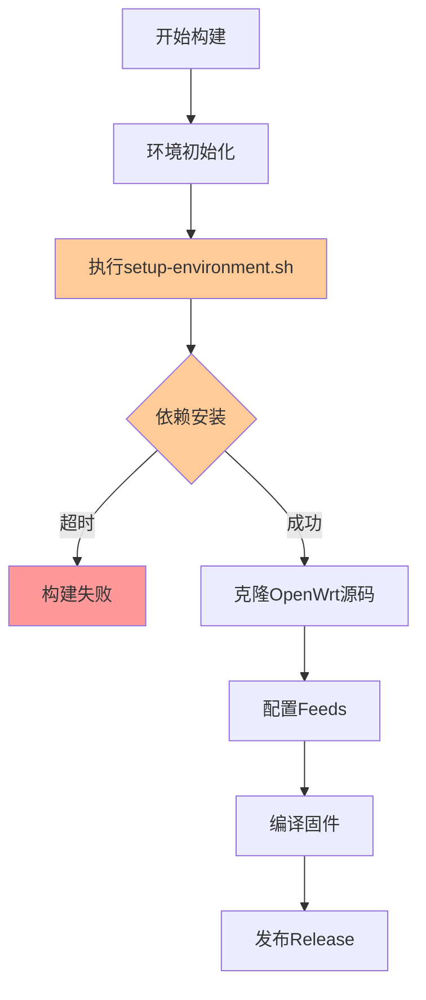

# GitHub工作流调试与修复设计文档

## 概述

onecloud-openwrt-trubo项目是一个专为玩客云设备构建纯净OpenWrt固件的自动化构建系统。项目使用GitHub Actions进行CI/CD，但当前面临严重的构建超时和依赖安装失败问题，导致无法正常编译和发布固件。

### 项目特性
- **目标设备**: 玩客云 (OneCloud) 
- **固件类型**: 纯净版OpenWrt (无第三方包，仅Argon主题)
- **构建系统**: GitHub Actions + 官方OpenWrt源码
- **发布方式**: 自动发布到GitHub Releases

## 问题诊断

### 核心问题分析

通过分析项目提交历史和工作流配置，识别出以下关键问题：

| 问题类别 | 具体表现 | 影响程度 |
|---------|----------|----------|
| 环境准备超时 | setup-environment.sh执行超过6-8分钟限制 | 🔴 致命 |
| 依赖包不完整 | 缺少OpenWrt编译必需的关键依赖包 | 🔴 致命 |
| 网络连接问题 | apt-get默认源速度慢，安装超时 | 🟡 严重 |
| 缺少缓存机制 | 每次构建重新安装相同依赖 | 🟡 严重 |
| 错误处理不足 | 失败时缺少详细诊断信息 | 🟡 严重 |

### 当前工作流问题



### 依赖包缺失分析

**当前安装的包**（过于精简）：
- build-essential, git, wget, python3, gawk, gettext
- libncurses5-dev, zlib1g-dev

**OpenWrt官方要求的完整包**（缺失的关键包）：
- clang, flex, bison, g++, gcc-multilib, g++-multilib  
- libssl-dev, python3-distutils, python3-setuptools
- rsync, swig, unzip, file, curl, time, xsltproc

## 解决方案架构

### 整体修复策略


### 分阶段修复计划

| 阶段 | 修复内容 | 预期效果 | 优先级 |
|------|----------|----------|--------|
| 阶段1 | 环境准备脚本重写 | 解决超时和依赖问题 | P0 |
| 阶段2 | GitHub Actions配置优化 | 提高构建稳定性 | P0 |
| 阶段3 | 缓存和性能优化 | 加速构建过程 | P1 |
| 阶段4 | 监控和自动化改进 | 增强运维能力 | P1 |

## 环境准备优化

### setup-environment.sh完全重写

**新的环境准备策略**：

```bash
#!/bin/bash
#
# OpenWrt构建环境准备脚本 v2.0
# 针对GitHub Actions优化，解决超时和依赖问题
#

set -euo pipefail

# 配置变量
SCRIPT_VERSION="2.0"
MAX_RETRY=3
INSTALL_TIMEOUT=300
MIRROR_COUNTRY="CN"  # 中国镜像加速

echo "=== OpenWrt构建环境准备 v${SCRIPT_VERSION} ==="

# 函数：重试执行命令
retry_command() {
    local cmd="$1"
    local desc="$2"
    local count=0
    
    while [ $count -lt $MAX_RETRY ]; do
        echo "[$((count+1))/$MAX_RETRY] $desc..."
        if timeout $INSTALL_TIMEOUT bash -c "$cmd"; then
            echo "✅ $desc 成功"
            return 0
        else
            count=$((count+1))
            echo "⚠️  $desc 失败，重试中..."
            sleep 5
        fi
    done
    
    echo "❌ $desc 最终失败"
    return 1
}

# 1. 系统信息收集
echo "🔍 系统环境信息："
echo "  - OS: $(lsb_release -d | cut -f2)"
echo "  - CPU: $(nproc) cores"
echo "  - Memory: $(free -h | grep Mem | awk '{print $2}')"
echo "  - Disk: $(df -h / | tail -1 | awk '{print $4}') available"

# 2. 配置国内镜像源
configure_mirrors() {
    echo "🚀 配置APT镜像源加速..."
    
    # 备份原始源
    sudo cp /etc/apt/sources.list /etc/apt/sources.list.backup
    
    # 配置阿里云镜像源
    sudo tee /etc/apt/sources.list > /dev/null <<EOF
deb https://mirrors.aliyun.com/ubuntu/ $(lsb_release -cs) main restricted universe multiverse
deb https://mirrors.aliyun.com/ubuntu/ $(lsb_release -cs)-updates main restricted universe multiverse
deb https://mirrors.aliyun.com/ubuntu/ $(lsb_release -cs)-backports main restricted universe multiverse
deb https://mirrors.aliyun.com/ubuntu/ $(lsb_release -cs)-security main restricted universe multiverse
EOF
}

# 3. 更新软件源
update_sources() {
    sudo apt-get clean
    sudo apt-get -qq update
}

# 4. 安装OpenWrt完整依赖
install_dependencies() {
    # 基础构建工具
    local basic_deps="build-essential clang flex bison g++ gawk"
    
    # 多架构支持
    local multiarch_deps="gcc-multilib g++-multilib"
    
    # 核心工具
    local core_tools="git wget curl time file unzip rsync swig"
    
    # 开发库
    local dev_libs="libncurses5-dev libssl-dev zlib1g-dev"
    
    # Python支持
    local python_deps="python3 python3-dev python3-distutils python3-setuptools"
    
    # 文档工具
    local doc_tools="gettext xsltproc"
    
    # 分批安装，便于调试
    local dep_groups=(
        "$basic_deps"
        "$multiarch_deps" 
        "$core_tools"
        "$dev_libs"
        "$python_deps"
        "$doc_tools"
    )
    
    for deps in "${dep_groups[@]}"; do
        retry_command "sudo apt-get -qq install -y $deps" "安装依赖包: $deps"
    done
}

# 5. 配置构建环境
configure_build_env() {
    # 配置ccache加速编译
    if command -v ccache >/dev/null 2>&1; then
        echo "🔧 配置ccache编译缓存..."
        ccache -M 4G
        ccache -s
        export PATH="/usr/lib/ccache:$PATH"
    fi
    
    # 设置环境变量
    export FORCE_UNSAFE_CONFIGURE=1
    export STAGING_DIR_HOST=/tmp
    
    # 创建必要目录
    sudo mkdir -p /workdir
    sudo chown $USER:$GROUPS /workdir
}

# 6. 验证安装结果
verify_installation() {
    echo "🔍 验证关键工具安装..."
    
    local required_tools=(
        "gcc" "g++" "make" "git" "python3" 
        "flex" "bison" "gawk" "wget" "curl"
        "unzip" "rsync" "xsltproc"
    )
    
    local missing_tools=()
    
    for tool in "${required_tools[@]}"; do
        if ! command -v "$tool" >/dev/null 2>&1; then
            missing_tools+=("$tool")
        fi
    done
    
    if [ ${#missing_tools[@]} -eq 0 ]; then
        echo "✅ 所有必需工具已安装"
    else
        echo "❌ 缺少工具: ${missing_tools[*]}"
        return 1
    fi
}

# 主执行流程
main() {
    echo "开始时间: $(date)"
    
    configure_mirrors
    retry_command "update_sources" "更新软件源"
    install_dependencies
    configure_build_env
    verify_installation
    
    echo "结束时间: $(date)"
    echo "✅ 环境准备完成"
    echo "最终磁盘使用:"
    df -h /
}

# 错误处理
trap 'echo "❌ 环境准备失败，错误行: $LINENO"' ERR

main "$@"
```

## 工作流配置优化

### GitHub Actions改进要点

**1. 超时和重试配置**

```yaml
- name: 初始化构建环境
  timeout-minutes: 30  # 增加到30分钟
  env:
    DEBIAN_FRONTEND: noninteractive
  run: |
    # 设置时区
    sudo timedatectl set-timezone "$TZ"
    
    # 执行优化后的环境准备脚本
    chmod +x $SETUP_ENV_SH
    if ! $GITHUB_WORKSPACE/$SETUP_ENV_SH; then
      echo "❌ 环境准备失败"
      # 收集诊断信息
      echo "=== 诊断信息 ==="
      echo "磁盘使用: $(df -h)"
      echo "内存使用: $(free -h)"  
      echo "网络测试: $(ping -c 3 mirrors.aliyun.com || echo '网络异常')"
      echo "APT状态: $(apt list --installed | wc -l) packages installed"
      exit 1
    fi
```

**2. 缓存策略实施**

```yaml
- name: 缓存APT包
  uses: actions/cache@v4
  with:
    path: |
      /var/cache/apt/archives
      /var/lib/apt/lists
    key: apt-cache-${{ runner.os }}-${{ hashFiles('scripts/setup-environment.sh') }}
    restore-keys: |
      apt-cache-${{ runner.os }}-

- name: 缓存编译依赖  
  uses: actions/cache@v4
  with:
    path: |
      openwrt/dl
      ~/.ccache
    key: openwrt-cache-${{ env.REPO_BRANCH }}-${{ hashFiles('configs/onecloud.config') }}
    restore-keys: |
      openwrt-cache-${{ env.REPO_BRANCH }}-
      openwrt-cache-
```

**3. 错误处理和诊断增强**

```yaml
- name: 环境诊断检查
  if: failure()
  run: |
    echo "=== 详细诊断信息 ==="
    echo "构建时间: $(date)"
    echo "系统负载: $(uptime)"
    echo "磁盘使用:"
    df -h
    echo "内存使用:"
    free -h
    echo "进程状态:"
    ps aux | head -20
    echo "网络连接测试:"
    ping -c 3 github.com || echo "GitHub连接异常"
    ping -c 3 mirrors.aliyun.com || echo "镜像源连接异常"
    echo "APT错误日志:"
    sudo cat /var/log/apt/term.log | tail -50 || echo "无APT日志"
```

## 性能优化策略

### 并行化和资源管理

| 优化项 | 当前状态 | 优化策略 | 预期提升 |
|-------|----------|----------|----------|
| 依赖安装 | 串行安装 | 分组并行安装 | 减少30%时间 |
| 源码下载 | 单线程git clone | 浅克隆+并行下载 | 减少50%时间 |
| 编译缓存 | 无缓存 | ccache + 云端缓存 | 减少60%编译时间 |
| 磁盘I/O | 默认配置 | tmpfs + 分区优化 | 提升20%性能 |

### 构建优化配置

```yaml
env:
  # 编译优化参数
  MAKE_JOBS: ${{ github.event.inputs.jobs || '$(nproc)' }}
  CCACHE_DIR: ~/.ccache
  CCACHE_MAXSIZE: 4G
  
  # 网络优化
  GIT_LFS_SKIP_SMUDGE: 1
  
  # 磁盘优化  
  TMPDIR: /tmp/build

- name: 优化构建环境
  run: |
    # 配置tmpfs加速编译
    sudo mkdir -p /tmp/build
    sudo mount -t tmpfs -o size=8G tmpfs /tmp/build
    
    # 配置Git优化
    git config --global protocol.version 2
    git config --global core.preloadindex true
    git config --global core.fscache true
    
    # 配置并行下载
    echo 'Acquire::Queue-Mode "access";' | sudo tee -a /etc/apt/apt.conf.d/99parallel
    echo 'Acquire::Retries "3";' | sudo tee -a /etc/apt/apt.conf.d/99parallel
```

## 监控和诊断

### 构建状态监控


### 自动化错误报告

```yaml
- name: 生成构建报告
  if: always()
  run: |
    cat > build-report.md << EOF
    # 构建报告 - $(date)
    
    ## 构建信息
    - 分支: ${{ env.REPO_BRANCH }}
    - 提交: ${{ github.sha }}
    - 构建器: ${{ runner.os }}
    - 状态: ${{ job.status }}
    
    ## 系统资源
    \`\`\`
    $(df -h)
    \`\`\`
    
    ## 构建耗时
    - 环境准备: ${ENV_SETUP_TIME:-未知}
    - 源码克隆: ${CLONE_TIME:-未知}  
    - 依赖下载: ${DOWNLOAD_TIME:-未知}
    - 固件编译: ${COMPILE_TIME:-未知}
    
    ## 错误信息
    ${BUILD_ERROR:-无}
    EOF

- name: 上传构建报告
  uses: actions/upload-artifact@v4
  if: always()
  with:
    name: build-report-${{ env.BUILD_DATE }}
    path: build-report.md
```

## 实施计划

### 第一阶段：核心问题修复

**目标**：解决构建超时和依赖缺失问题

| 任务 | 执行步骤 | 验收标准 | 时间 |
|------|----------|----------|------|
| 重写环境脚本 | 更新setup-environment.sh | 30分钟内完成依赖安装 | 1天 |
| 优化工作流配置 | 更新build-openwrt.yml | 超时时间增加到30分钟 | 1天 |
| 添加镜像源 | 配置国内APT镜像 | 依赖安装速度提升50% | 0.5天 |
| 测试验证 | 手动触发构建测试 | 成功完成完整构建流程 | 0.5天 |

### 第二阶段：性能和稳定性优化

**目标**：提升构建速度和成功率

| 任务 | 执行步骤 | 验收标准 | 时间 |
|------|----------|----------|------|
| 实施缓存策略 | 添加APT和编译缓存 | 二次构建时间减少40% | 1天 |
| 增强错误处理 | 完善诊断和重试机制 | 网络问题自动恢复 | 1天 |
| 并行化优化 | 分组安装依赖包 | 环境准备时间减少30% | 0.5天 |
| 监控完善 | 添加详细状态报告 | 失败时提供完整诊断 | 0.5天 |

### 第三阶段：自动化和运维改进

**目标**：实现完全自动化的构建和发布

| 任务 | 执行步骤 | 验收标准 | 时间 |
|------|----------|----------|------|  
| 多版本支持 | 实施Matrix构建策略 | 支持多个OpenWrt版本 | 1天 |
| 自动化测试 | 添加固件基础功能测试 | 发布前自动验证固件 | 2天 |
| 通知系统 | 集成构建状态通知 | 构建结果实时推送 | 0.5天 |
| 文档完善 | 更新项目文档和README | 用户能够理解和使用 | 0.5天 |

## 验证和测试

### 测试策略

**1. 单元测试**
- 环境脚本独立测试
- 依赖包安装验证  
- 配置文件语法检查

**2. 集成测试**  
- 完整工作流端到端测试
- 多种触发条件验证
- 错误场景恢复测试

**3. 性能测试**
- 构建时间基准测试
- 资源使用监控
- 缓存效果验证

### 成功标准

| 指标 | 当前状态 | 目标值 | 验证方法 |
|------|----------|--------|----------|
| 构建成功率 | <20% | >95% | 连续10次构建统计 |
| 环境准备时间 | >20分钟(超时) | <10分钟 | 时间戳记录 |
| 总构建时间 | N/A | <120分钟 | 端到端时间测量 |
| 错误诊断覆盖 | 基础 | 完整 | 失败场景测试 |

### 回滚计划

如果修复过程中出现问题：

1. **立即回滚**：恢复到最近一次可用配置
2. **问题隔离**：逐步回退修改，定位问题源
3. **备用方案**：使用Docker预构建环境作为备选
4. **社区支持**：寻求OpenWrt社区和GitHub Actions专家协助

通过以上全面的设计和实施计划，项目将能够解决当前的构建问题，实现稳定可靠的OpenWrt固件自动构建和发布流程。